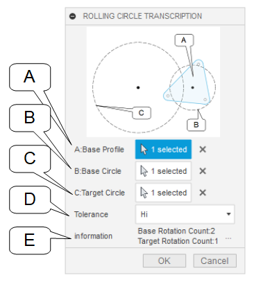

# ***Fusion360  Rolling Circle Transcription***
This is an add-in for the Autodesk software "Fusion360".

It transfers the shape by two circular motions.
We worked on [this](https://forums.autodesk.com/t5/fusion-360-api-and-scripts/weird-gears-help-in-scripting/td-p/9840513) one.

***
## Installation:
Please follow the instructions [here](https://knowledge.autodesk.com/support/fusion-360/troubleshooting/caas/sfdcarticles/sfdcarticles/How-to-install-an-ADD-IN-and-Script-in-Fusion-360.html).

## Usage

- Launch the add-in.　 A command is added in the "Create" tab of "Solid" or "Surface".

- Execute the command.。

- A dialog appears. Please select each item.

    - A (base profile) : the single profile of the source of the transcription.
    - B (Base Circle) : the circle from which the profile is to be transferred.
    - C (target circle) : the circle to be transcribed.
        - In the ratio of the diameter of the target circle to the base circle,
        The number of revolutions of each other will be determined.
        - If the ratio of the diameters is an irrational number, it is an approximation.
    - D (tolerance) : the tolerance to be transferred. It is the angle of one unit rotation of the target circle when transcribing.
        - Low : 10 deg
        - mid : 4 deg
        - Hi : 2 deg
    - E (Information) : If three pieces of A, B, C are selected, the selection information will be displayed.
        - When the correct selection is made, it displays the number of rotations of the base circle and the target circle.
        It is recommended to review the diameter of each circle, as a large number of rotations will take too long to process.
        - If you have made a wrong selection, the OK button will show you why it is grayed out.

- Press the OK button to start the animation you want to create.

## Constraints：
- The base profile, base circle, and target circle can be drawn in different sketches, but they must all exist in the same plane.
- A profile, circle that does not exist on the sketch plane (floating in the air like in a 3D sketch) cannot be executed.

## Issue：
- ~~Cumbersome to call (To add-in)~~
- English notation only (Make it multilingual)
- Reverse Rotation Support
- Not supported for components
- Support for multiple profiles in the base profile
- Targeted also pre-run profile support
- Response to sketches and solids in processing results

## Action:
Confirmed in the following environment.
+ Fusion360 Ver2.0.9313
+ Windows10 64bit Pro , Home

## License:
MIT

## Acknowledgments:
+ Thank you everyone in the [Japanese forum.](https://forums.autodesk.com/t5/fusion-360-ri-ben-yu/bd-p/707)

***
***
以下、日本語です。

これは、オートデスクソフトウェア「Fusion360」のアドインです。

2つの円運動により、形状を転写します。
[こちら](https://forums.autodesk.com/t5/fusion-360-api-and-scripts/weird-gears-help-in-scripting/td-p/9840513)に取り組みました。

## インストール:
[こちら](https://knowledge.autodesk.com/ja/support/fusion-360/troubleshooting/caas/sfdcarticles/sfdcarticles/JPN/How-to-install-an-ADD-IN-and-Script-in-Fusion-360.html)の手順に従ってください。

***
## 使用法
- アドインを起動。"ソリッド" 又は "サーフェス" の "作成" タブ内にコマンドが追加されます。

- コマンドを実行。

- ダイアログが表示されます。各項目を選択して下さい。

    - A(ベースプロファイル) : 転写元の単一のプロファイル。
    - B(ベースサークル) : 転写元の円。
    - C(ターゲットサークル) : 転写される円。
        - ベースサークルとターゲットサークルの直径の比率で,
        お互いの回転数が決定します。
        - 直径の比率が無理数となる場合は、近似数となります。
    - D(トレランス) : 転写するトレランス。転写する際のターゲットサークルの1単位回転角度です。
        - Low : 10 deg
        - mid : 4 deg
        - Hi : 2 deg
    - E(情報) : A,B,C 3個が選択された場合、選択情報を表示します。
        - 正しい選択時には、ベースサークルとターゲットサークルの回転数を表示します。
        回転数が多い場合は処理時間が掛かりすぎるため、各円の直径の見直しをお勧めします。
        - 誤った選択を行っている場合、OKボタンがグレーアウトしている理由を表示します。

- OKボタンを押すことで作成するアニメーションがスタートします。

## 制約：
- ベースプロファイル・ベースサークル・ターゲットサークルの3個は、異なるスケッチで描かれていても問題ありませんが、全て同一平面上に存在している必要があります。
- スケッチ平面上に存在していない(3Dスケッチのように宙に浮いた)プロファイル・円では実行出来ません。

## 問題：
- ~~呼び出しが面倒 (アドイン化)~~
- 英語表記のみ (多言語化)
- 逆回転対応
- コンポーネントに対して未対応
- ベースプロファイルを複数プロファイル対応
- ターゲットにも実行前プロファイル対応
- 処理結果のスケッチ・ソリッドへの対応

## アクション:
以下の環境で確認しています。
 + Fusion360 Ver2.0.9313
 + Windows10 64bit Pro , Home

## ライセンス:
MIT

## 謝辞:
+ [日本語フォーラム](https://forums.autodesk.com/t5/fusion-360-ri-ben-yu/bd-p/707)の皆さん、ありがとう。
+ 上記の英語で不適切な部分をして頂けると助かります。